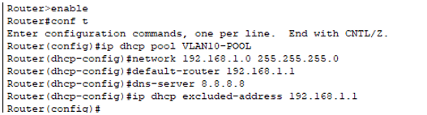

# Description for setting up DHCP for Vlan10 

## Overview
- Vlan 10 is for clients, general users which wouldn't need static IP for each devices.
- Therefore, setted vlan 10 with DHCP using the router. 

## Set up process 
- 
- Accessed to terminal mode then 'ip dhcp VLAN10-POOL' allows to access dhcp service for vlan10.
- 'network 192.168.1.0 255.255.255.0' set network address and subnet.
- It will make range of dhcp for clients to 192.168.1.1~192.168.1.254. 
- 'dns-server 8.8.8.8' will set all clients to use dns 8.8.8.8.
- 'ip dhcp excluded-address 192.168.1.1' will exclude ip address 192.168.1.1 from dhcp since it's vlan10 ip.